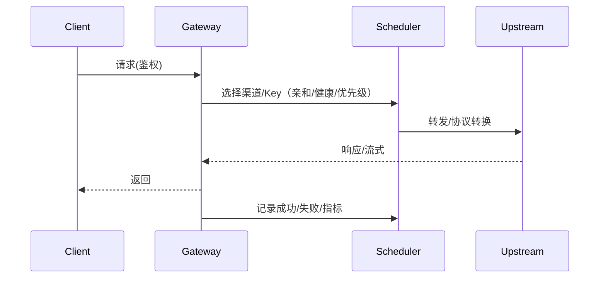

# 架构设计

## 总体架构
```mermaid
flowchart TD
    U[客户端/SDK/CLI] --> G[proxy-gateway (Gin)]
    G -->|/| UI[前端静态资源（embed）]
    G -->|/api/*| Admin[管理 API]
    G -->|/v1/messages| ClaudeMsg[Claude Messages 代理]
    G -->|/v1/responses| OpenAIResp[Responses 代理]
    G -->|/v1beta/models/*| Gemini[Gemini 代理]
    Admin --> Cfg[.config/config.json]
    ClaudeMsg --> Sch[ChannelScheduler]
    OpenAIResp --> Sch
    Gemini --> Sch
    Sch --> Providers[Providers/Converters]
    Providers --> Upstream[上游服务]
    Sch --> Metrics[Metrics/Logs]
```

## 技术栈
- **后端:** Go / Gin / embed
- **前端:** Vue 3 / Vite / Vuetify 3
- **数据:** 文件配置（`.config/config.json` + backups）

## 核心流程


## 重大架构决策
完整的 ADR 存储在各变更的 `how.md` 中，本章节提供索引。

| adr_id | title | date | status | affected_modules | details |
|--------|-------|------|--------|------------------|---------|
| - | - | - | - | - | - |

